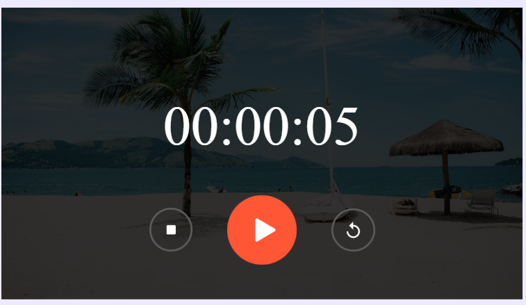

# ⏱️ Stopwatch Web Application

A simple, responsive, and user-friendly Stopwatch Web Application built using HTML, CSS, and Vanilla JavaScript.  
This project demonstrates fundamental JavaScript concepts such as DOM manipulation, event handling, and time-based functions using `setInterval()`.

The stopwatch allows users to accurately track time with Start, Pause, and Reset functionalities in a clean and minimal interface.

---

## 📸 Preview



---

## 🚀 Features

- ▶️ Start the stopwatch
- ⏸️ Pause the stopwatch
- 🔄 Reset the stopwatch
- 🕒 Displays time in Hours : Minutes : Seconds format
- 📱 Responsive and clean UI design
- ⚡ Real-time time update using JavaScript

---

## 🛠️ Technologies Used

- HTML5 – Structure of the application  
- CSS3 – Styling and responsive layout  
- JavaScript (Vanilla JS) – Functionality and logic implementation  

---

## 📂 Project Structure

```
Stopwatch/
│
├── index.html
├── style.css
└── script.js
```

- `index.html` → Contains the layout and structure  
- `style.css` → Handles design and styling  
- `script.js` → Contains stopwatch logic and functionality  

---

## 💡 How It Works

- The stopwatch uses the `setInterval()` function to increment time every second.
- Time is calculated in seconds and converted into hours, minutes, and seconds.
- DOM manipulation is used to dynamically update the displayed time.
- Event listeners are attached to buttons for Start, Pause, and Reset actions.
- The timer stops correctly using `clearInterval()` to prevent multiple intervals.

---

## 📌 Learning Outcomes

Through this project, I practiced:

- JavaScript timing functions (`setInterval`, `clearInterval`)
- DOM selection and manipulation
- Event handling
- Writing clean and structured code
- Basic UI design and responsiveness

---

## 🔮 Future Improvements

- Add Lap functionality
- Add Dark Mode toggle
- Add Sound notification on reset
- Improve UI animations
- Store time history using Local Storage

---

## 👩‍💻 Author

**Priya**  
Aspiring Software Developer  
Currently focusing on DSA (Java) and Web Development  
Passionate about building clean and functional web applications 🚀 
